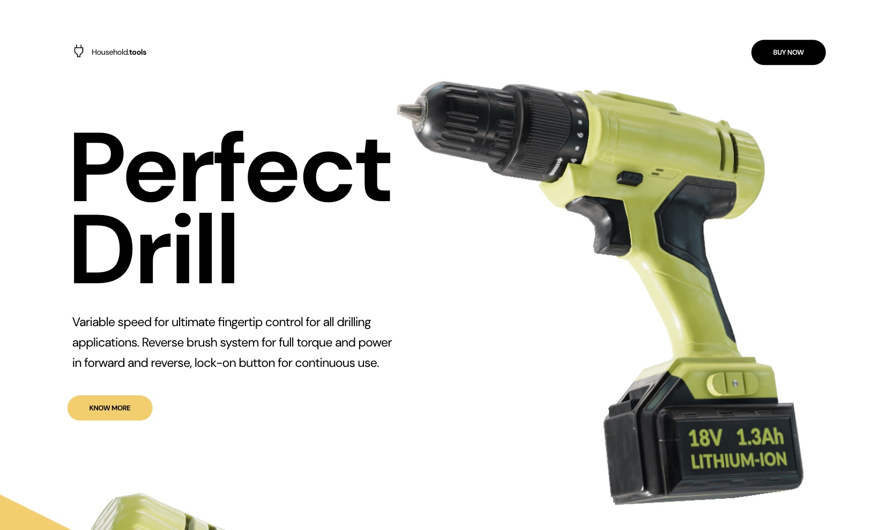

# Threejs + GSAP + WEBGi

⚡️ Live Link: [http://drill-store.vercel.app](http://drill-store.vercel.app)

<a href="http://drill-store.vercel.app"></a>


## Getting started
First install the dependencies:
```bash
npm install
```

To run the project in development mode:
```bash
npm start
```
Then navigate to [http://localhost:1234/index.html](http://localhost:1234/index.html) in a web browser to see the default scene in a viewer.

The assets are stored in the `assets` directory.

To build the project for production:
```bash
npm run build
```

## Documentation

About webgi: [https://webgi.xyz/](https://webgi.xyz/)

For the latest version and documentation: [WebGi Docs](https://webgi.xyz/docs/).
